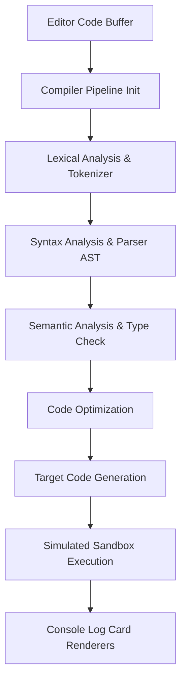
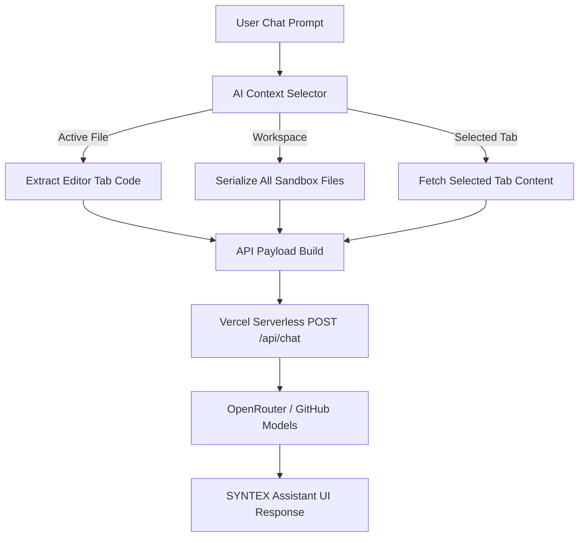

# 𝗦𝗬𝗡𝗧𝗘𝗫 𝗔𝗜 — Next-Gen Interactive AI Compiler Studio

Synthex AI is a premium, high-performance compiler workspace and interactive visual environment. It features a full multi-tab directory explorer, static code diagnostics, execution pipelines, and an intelligent context-aware chat assistant built for engineers.

---

## 🚀 Key Features

* **Light-Following Hover Borders**: Bento cards feature dynamic cursor tracking that guides a radial spotlight across card boundaries.
* **Organic Background Noise**: Minimal SVG micro-grain texture layered over smooth gradients for depth.
* **Advanced Compiler Pipeline**: Complete lexical analysis, AST generation, semantic validation, optimization passes, and sandboxed run histories.
* **Multi-Tab File Manager**: Compact directory tree supporting file creation, removal, and tabs tracking.
* **AI Diagnostic Panel**: Real-time code analysis, structural correction proposals, and auto-apply code refactoring.
* **Context-Aware SYNTEX Chat**: Link assistant questions directly to the **Active Tab**, the **Entire Workspace**, or a **specific open file**.

---

## 📊 System Architecture & Data Flow

### 1. Compiler Pipeline Execution
The flowchart below illustrates how client source buffers transition through compile stages:



### 2. Context-Aware AI Chat Flow
The selector links prompt requests with sandbox code targets dynamically:



---

## 🛠️ Installation & Local Setup

### Prerequisites
* [Node.js](https://nodejs.org) (v18+)

### 1. Install Dependencies
```bash
npm install
```

### 2. Configure Environment variables
Create a `.env` file in the project root:
```env
# Primary API Endpoint Key
OPENROUTER_API_KEY=your_openrouter_api_key_here

# Fallback API Endpoint Key
GITHUB_TOKEN=your_github_personal_access_token_here
```

### 3. Run Development Server
```bash
# Starts client on port 3000 + backend proxy middleware
npm run dev
```

### 4. Build Production Bundle
```bash
npm run build
```

---

## 🌐 Production Vercel Deployment

Synthex AI is fully optimized for Vercel Serverless deployments.

1. **Import Repository**: Connect your Github repository to the Vercel Dashboard.
2. **Build Settings**: Vercel automatically detects the Vite configuration:
   * Build Command: `npm run build`
   * Output Directory: `dist`
3. **Environment Variables**: Add `OPENROUTER_API_KEY` and `GITHUB_TOKEN` to your project environment settings.
4. **Deploy**: Click deploy. Vercel utilizes `vercel.json` to map all `/api/*` requests to the serverless wrapper in `/api/index.ts` seamlessly.

---

## 📄 Apache License 2.0

Copyright 2026 Syntex AI Developers

Licensed under the Apache License, Version 2.0 (the "License");
you may not use this file except in compliance with the License.
You may obtain a copy of the License at

    http://www.apache.org/licenses/LICENSE-2.0

Unless required by applicable law or agreed to in writing, software
distributed under the License is distributed on an "AS IS" BASIS,
WITHOUT WARRANTIES OR CONDITIONS OF ANY KIND, either express or implied.
See the License for the specific language governing permissions and
limitations under the License.
