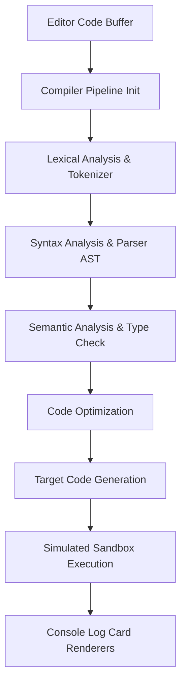
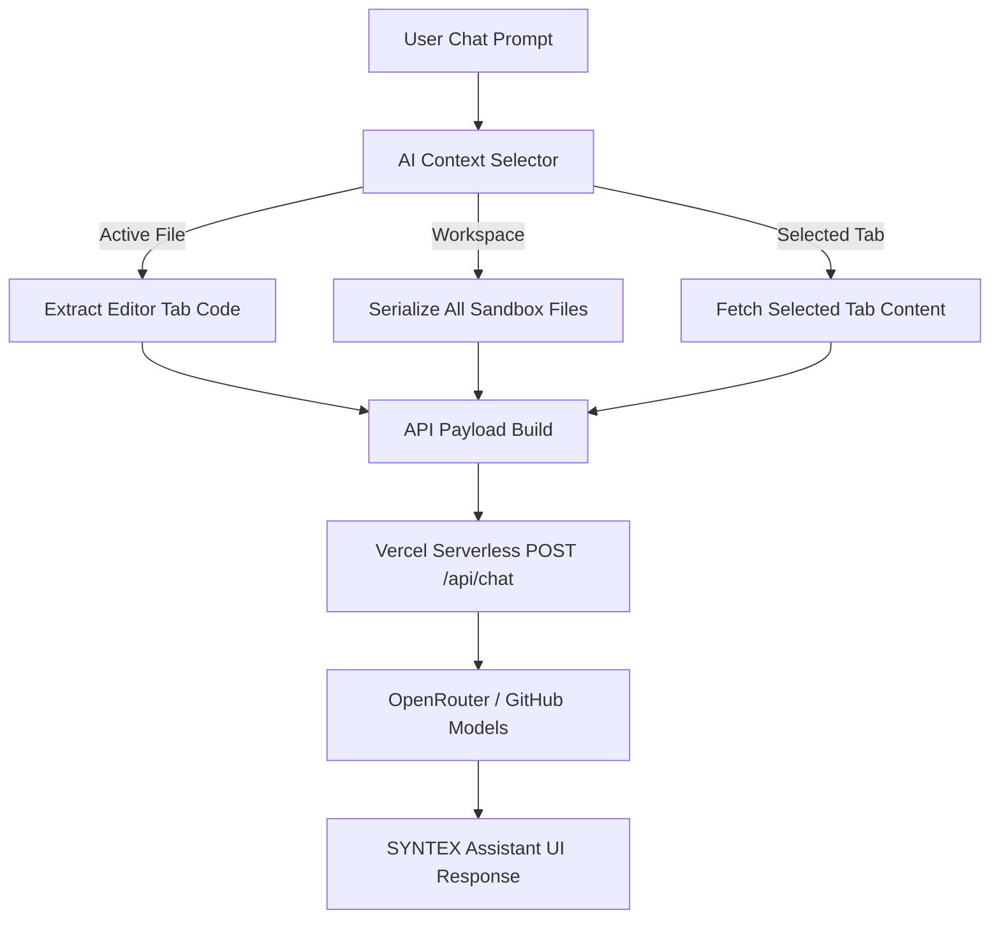

# 𝗦𝗬𝗡𝗧𝗘𝗫 𝗔𝗜 — Next-Gen Interactive AI Compiler Studio

Synthex AI is a premium, high-performance compiler workspace and interactive visual environment. It features a full multi-tab directory explorer, static code diagnostics, execution pipelines, and an intelligent context-aware chat assistant built for engineers.

---

## 🚀 Key Features

* **Light-Following Hover Borders**: Bento cards feature dynamic cursor tracking that guides a radial spotlight across card boundaries.
* **Organic Background Noise**: Minimal SVG micro-grain texture layered over smooth gradients for depth.
* **Advanced Compiler Pipeline**: Complete lexical analysis, AST generation, semantic validation, optimization passes, and sandboxed run histories.
* **Multi-Tab File Manager**: Compact directory tree supporting file creation, removal, and tabs tracking.
* **AI Diagnostic Panel**: Real-time code analysis, structural correction proposals, and auto-apply code refactoring.
* **Context-Aware SYNTEX Chat**: Link assistant questions directly to the **Active Tab**, the **Entire Workspace**, or a **specific open file**.

---

## 📊 System Architecture & Data Flow

### 1. Compiler Pipeline Execution
The flowchart below illustrates how client source buffers transition through compile stages:

### 2. Context-Aware AI Chat Flow
The selector links prompt requests with sandbox code targets dynamically:

---

## 📖 About Syntex AI

**Syntex AI** is a state-of-the-art, interactive IDE and compiler simulation suite engineered to bridge the gap between AI-driven assistance and classical compiler construction. Developed for developers, educators, and language enthusiasts, Syntex AI provides a visually stunning, reactive dashboard to write, parse, optimize, and translate code in real-time.

### 🌟 Project Vision & Purpose
Most modern developer tools hide the compiler pipeline behind a black box. Syntex AI demystifies this process by breaking down compilation into its fundamental, logical stages:
1. **Lexical Analysis**: Breaking code blocks into raw, categorized token streams.
2. **Abstract Syntax Tree (AST)**: Visualizing syntactic hierarchy with interactive nodes.
3. **Semantic Analysis**: Verifying variable scopes, declarations, and type correctness.
4. **Optimization Passes**: Simulating dead-code elimination, constant folding, and loop checks.
5. **Code Translation**: Compiling source programs into fully optimized Lex/Flex specifications or target scripts.
6. **Execution Sandbox**: Running the output code inside a simulated runtime to capture output logs.

### 🧠 Intrinsic AI Diagnostics
Powered by GitHub Models and OpenRouter, the compilation process is augmented with inline AI diagnostics. When compilation issues arise, Syntex AI highlights the specific error lines, provides human-readable explanations of compiler behavior, and automatically generates code fixes that can be applied to the editor with a single click.

---

## 📄 Apache License 2.0

Copyright 2026 Syntex AI Developers

Licensed under the Apache License, Version 2.0 (the "License");
you may not use this file except in compliance with the License.
You may obtain a copy of the License at

    http://www.apache.org/licenses/LICENSE-2.0

Unless required by applicable law or agreed to in writing, software
distributed under the License is distributed on an "AS IS" BASIS,
WITHOUT WARRANTIES OR CONDITIONS OF ANY KIND, either express or implied.
See the License for the specific language governing permissions and
limitations under the License.
